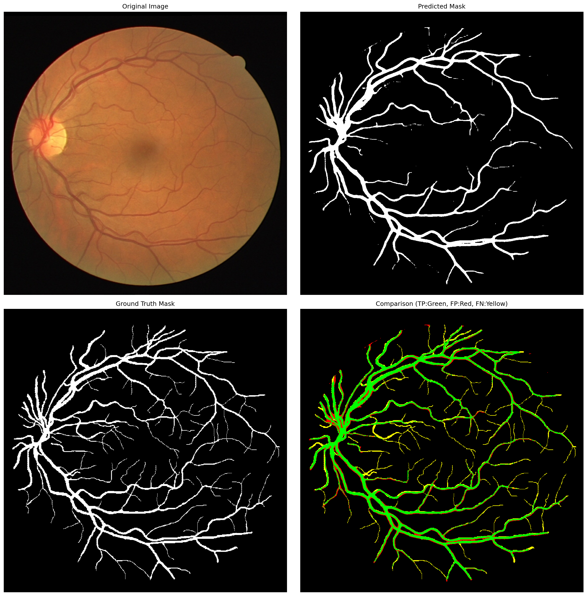
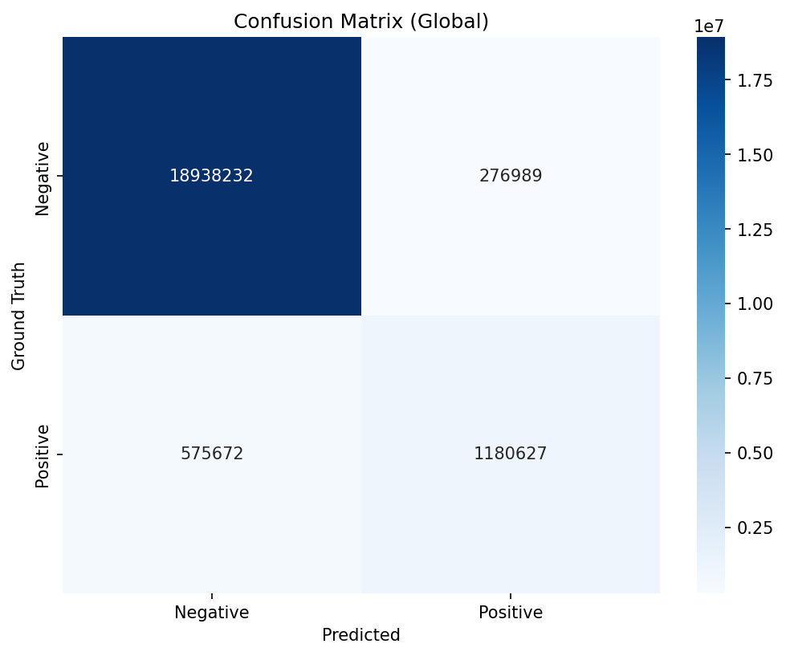

# 基于Yolov11s+SAM的眼底图像分割模型

## 项目简介

本项目实现了一种结合 Yolov11s 目标检测与 Segment Anything Model (SAM) 分割技术的眼底图像分割方案。该方案旨在解决眼底图像中微小病变区域的精确分割问题，为眼科疾病的早期诊断提供辅助支持。

本项目结合了两种先进的深度学习技术：
- **Yolov11s**：最新一代的高效目标检测模型，具有速度快、精度高的特点，用于快速定位眼底图像中的病变区域
- **SAM**：Meta AI 开发的通用图像分割模型，能够根据提示（如边界框）生成精确的分割掩码

## 方法概述

本方案采用两阶段处理流程：

1. **目标检测阶段**：使用 Yolov11s 模型检测眼底图像中的病变区域，输出边界框坐标
2. **精确分割阶段**：将 Yolov11s 输出的边界框作为提示输入到 SAM 模型中，生成精确的病变区域分割掩码

## 项目结构

| 简介         | 所在目录                                                     |
| ------------ | ------------------------------------------------------------ |
| 模型定义类   | [./models](./models)                                         |
| 训练脚本类   | [./scripts](./scripts)                                       |
| YOLO训练     | [./drive/train_yolo.ipynb](./drive/train_yolo.ipynb)         |
| SAM+Yolo训练 | [./drive/train_SAM_yolo.ipynb](./drive/train_SAM_yolo.ipynb) |
| 可视化代码   | [./drive/visualize_final.ipynb](./drive/visualize_final.ipynb) |
| 全面评估     | [./drive/evaluate.ipynb](./drive/evaluate.ipynb)             |
| 可视化结果   | [./drive/final_vis](./drive/final_vis)                       |
| 全面评估结果 | [./drive/evaluate](./drive/evaluate)                         |

## 数据集

本项目主要支持以下数据集：
- **DRIVE**：眼底血管分割数据集，包含 40 张彩色眼底图像

## 结果展示

### 分割效果可视化

#### 单张效果图

#### 融合效果图

### 评估指标展示

| 指标      | 数值   | 说明                     |
| --------- | ------ | ------------------------ |
| Dice 系数 | 0.7347 | 分割结果与真值的重叠程度 |
| IoU       | 0.5806 | 交并比，评估分割精度     |
| 准确率    | 0.8100 | 分类准确率               |
| 召回率    | 0.7347 | 病变区域检测的召回率     |

## 评估分析

| 指标                | 原文 YOLO-SAM（全局均值） | 新评估结果 | 差异分析                                 |
| ------------------- | ------------------------- | ---------- | ---------------------------------------- |
| Dice 系数           | 0.601 ± 0.330             | 0.7347     | 新结果提升 **22.2%**                     |
| IoU（交集并集比）   | -（原文未报告）           | 0.5806     | 与原文 Dice 趋势一致，反映分割重叠度良好 |
| 精确率（Precision） | -（原文未报告）           | 0.8100     | 高精确率说明假阳性标注少                 |
| 召回率（Recall）    | -（原文未报告）           | 0.6722     | 召回率略低于精确率，存在少量漏检         |
| F1-Score            | -（原文未报告）           | 0.7347     | 与 Dice 系数相等（二分类场景下数学等价） |

- 新评估的 Dice 系数（0.7347）远超原文 YOLO-SAM 的全局均值（0.601），提升幅度达 22.2%，说明分割结果与标准的重叠度更高，核心性能更优。
- 原文中最优子队列（Cohort 7）的 Dice 系数为 0.666 ± 0.377，新结果（0.7347）仍高出约 10.3%，即使对比原文表现最好的数据集，新模型仍有明显优势。

## 许可证

本项目采用 MIT 许可证，详见 [LICENSE](../LICENSE) 文件。
